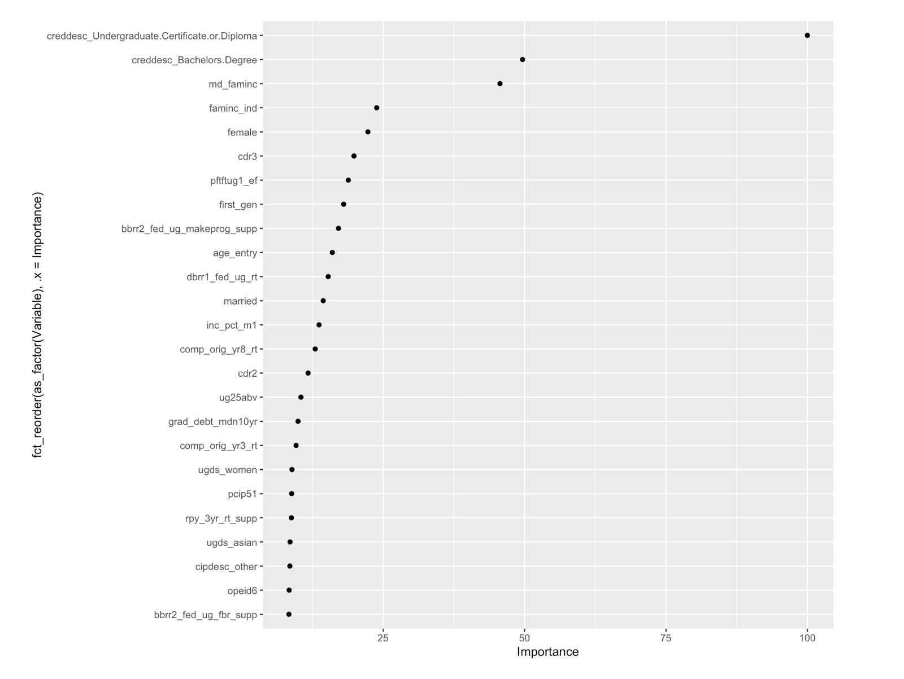

```{r setup, echo=F, include=F, message=F, warning=F, error=F}

libs <- c("tidyverse", "janitor", "scales", "bibtex", "ggridges", "haven", "knitr", "rmarkdown", "here")

sapply(libs, require, character.only = TRUE)

knitr::opts_chunk$set(echo = FALSE,
                      warning = FALSE,
                      include = TRUE,
                      message = FALSE,
                      fig.width = 10,
                      fig.height = 10)

```


```{r}
cb_df <- read_rds(here("data","cleaned","cb_df.Rds"))
```

## Abstract  

This project uses a principled machine-learning approach to predict
recent college graduates' earnings using data from the College
Scorecard. Early results support the predictive capabilities of
institutional characteristics like school classification and overall
debt repayment rates on recent graduate earnings.

\newpage

## Objective/Background

The broad objective of this project involves the prediction of program earnings for recent college graduates using common institutional/program variables available via the College Scorecard website. Econometric approaches to predicting earnings after graduation are not uncommon in the higher education literature, as many researchers in the field have attempted to support college-going behavior due to its generous return on investment. @Oreopoulous_Petronijevic_2013 take a comprehensive look at the research available on market returns to higher education, reviewing 30 years of literature that ultimately demonstrate an economic advantage & higher earnings potential for those individuals with a college education. However, @Carnevale_etal_2011 notes an important caveat for this general earnings boost: the potential earnings increase depends on the type of degree/credential earned, program of study, etc.

The creation and publication of the College Scorecard by the
U.S. Department of Education presented an opportunity for families to identify the institutions that provided the best labor outcomes for their students with the least amount of financial burden [@obama_2013]. Made publicly available in 2015, the data in the College Scorecard (while illuminating varied institutional characteristics), did not generally produce the kind of impact the Obama administration envisioned and went mostly underutilized. It also fell short of providing complete data profiles of institutional/program characteristics, as much of the data eventually published were missing or privacy suppressed.

Despite its shortcomings, the College Scorecard data have been used in conjunction with common econometric approaches to evaluate student responsiveness to the Scorecard. In particular, @hurwitz_student_2018 utilizes a DID model that demonstrates the decision-making changes in generally well-resourced high school
students after the publication of the Scorecard, directing their SAT
scores to schools that, on average, had higher median earnings for
graduates; the two other hallmarks of the Scorecard (graduation rates
and average costs), produced virtually no change in SAT score-sending
behaviors. Other higher education/economics researchers have adopted econometric methodological approaches while engaging the earnings data
available on the Scorecard in particular institutional & program
contexts [@boland_effect_2021; @elu_earnings_2019; @mabel_value_2020;
@seaman_assessing_2017]. It's important, however, to highlight the tendency of econometric methods to misspecify models & lend itself to selector/researcher bias [@Imbens_2004].

Machine learning, in contrast, allows the computer & corresponding algorithms to determine the model & ultimately train the model to promote increased accuracy. While commonly associated with convoluted computational statistics and computer programming methods, it has crept into the education (particularly higher education) field to bolster model accuracy and potential estimates in quantitative higher education studies. In particular, the last 6-7 years have seen an uptick in higher education research projects utilizing machine
learning methods [@aulck2017predicting; @savvas_etal_2021;
@Zeineddine_2021]. With this increase in prominence, how does this
project stand out?

This project fills a dire gap in higher education literature by not
only utilizing the myriad institutional data points available on the
Scorecard, but marrying these data with novel machine learning
techniques that improve the predictive capacity of common
institutional characteristics in determining potential graduate earnings.


## Methodology

Our methodology is defined by machine-learning approaches to data
analysis, characterized by the use of a model workflow, feature
engineering for model use and elastic net/random forest regression
models to appropriately fit our data and identify potential income
predictors [@Hastie_etal_2016; @Kuhn_Silge_2022].

More specifically, we first read in the College Scorecard data (the
field of study and all data elements files, specifically) and
perform necessary preprocessing work to 1) drop data that were
privacy suppressed/missing, 2) recode categorical data to workable
dummy-coded variables and 3) drop zero variance/highly correlated
predictors.

Next, we perform kfold cross validation (20 folds) on the training
set data to set the foundation for model selection/evaluation. Two
regression-based methods (elastic net and random forest) are utilized
to build subsequent models, add models to built workflow and fit the models to resampled data. We then perform tuning for both models to ensure maximum predictive capacity. The two identified models, elastic net regularization 
and random forest regression, are particularly useful in our project, as they provide for 1) principled predictor selection from a large set of possible determinants of earnings and 2) identification of non-linear relationships between predictors. Elastic net regularization is an improved version of the LASSO method that combines penalties to remove non-predictive coefficients. Random forest regression models produce variable cases and forces a vote on the most likely outcome for the covariate in question.

These methods result in predictive estimates for both the elastic
net and random forest regression models critical to our ultimate
analyses/findings. These predictors are variables identified in the
Scorecard dataset that are highly predictive indicators of our
dependent variable: median earnings from graduates of the program
after 1 year.


## Data 

Data for this project originate from two specific sources: the College
Scorecard and the most recent American Community Survey 5-year
estimates (2016-2020), selecting 2019 data to align with the recent
2019-20 school year data featured in the Scorecard. The Scorecard
provided us with our dependent variable data (median earnings for
college graduates 1 year after graduation), and accompanied with the
ACS county-level data, contributes the numerous possible predictors
for our models.

More specifically, the ACS county data feature FIPS codes to uniquely
identify each county, calculations for: 1) the percentage of county
bachelor's degree holders, 2) the percentage of homeowners in each
county and 3) the percentage of individuals identified in the county
labor force and the median household income for each county (for most
recent 12 months, using 2019-adjusted dollars). 

The College Scorecard data present 2,000+ variables featuring institutional characteristics and program-level data for 6,700 accredited institutions in the U.S., including type of institution, degrees awarded, number of loan
borrowers and the like. FIPS codes are also featured in this data set,
allowing for appropriate matching of institutions to their location in
each county first identified by the ACS data. Much of the Scorecard
data based in more specific, individual student information were suppressed for privacy reasons; however, this provided us an opportunity to recover lost information via the ACS data and other variables in the Scorecard that were not suppressed to use in our analyses.

## Preliminary Findings

In our first 3 figures, we delineate the median first year earnings of
different degree holders (Bachelors, Associates and
Certificates/Diplomas). In looking at these figures descriptively, we
find an increase in earnings potential for Bachelors degree holders as
compared to Associates/Certificate degree holders in similar fields of
study. However, this conclusion necessitates further analyses to
determine the predictive capabilities of things other than field of
study (institutional characteristics, student traits, etc.) in
determining the incomes of recent college graduates. 

Both the elastic net and random forest regression models produced
estimates to inform the predictive capabilities of certain
program/institutional characteristics. Figure 4 demonstrates those
estimates from the elastic net model, identifying typically assumed positive
predictors of income like type of school, type of degree/credential;
however, this model also illuminated particularly unexpected
predictors like outstanding federal loan balance and median debt for
graduated students.

In our random forest regression model (Figure 5), we see a similar
emphasis on the importance of type of degree credential (specifically
Certificates/Diplomas and Bachelors Degrees); we also see the
importance of median family income and average family income for those
students considered independents (both income values in real 2015
dollars). Unexpected, however, were the appearances of 3-year cohort
default rates and the percentage of students who completed their
coursework within 8 years at the original institution (Satisfactory
Academic Progress).


## Study Significance

While the technical nature of machine learning approaches can seem far
removed from the higher education policy landscape at large, this
study, at its foundation, cares about the material outcomes for
students investing their money and time in their educational
futures. More specifically, we are preoccupied with identifying the
greatest predictors of college graduates' incomes to ultimately inform
good policy & practice that amplifies positive student earnings
potential. 

Machine learning approaches hold incredible possibilities in providing
the most accurate estimates of the data points we as higher education
practitioners/researchers care so deeply about: student outcomes. It
is evident that the integration of machine learning into higher
education research methods/practice has already begun, and this
project adds to this movement and solidifies its place in the higher
education policy landscape. 

Ultimately, this project serves not only as a new venture that coalesces 
machine learning and higher education research to estimate student earnings, 
but provides more accurate estimates of said earnings than would otherwise be achieved through typical econometric approaches. These improved estimates are paramount to the creation and support of enhanced policy approaches that focus 
on supporting existing successful programs/institutions and identifying areas of development.


\newpage

```{r}
cb_df<-read_rds(here("data","cleaned","cb_df.Rds"))
```

# Figures

## Figure 1 

### First Year Earnings of Bachelor's Degree Holders

```{r}
cb_df%>%
  group_by(cipdesc,creddesc)%>%
  select(earn_mdn_hi_1yr,creddesc,cipdesc)%>%
  mutate(count=n())%>%
  filter(count>20)%>%
  mutate(mean_earn=mean(earn_mdn_hi_1yr,na.rm=TRUE))%>%
  group_by(creddesc)%>%
  arrange(creddesc,desc(mean_earn)) %>% 
  mutate(earn_rank=rank(-mean_earn))%>%
  filter(earn_rank<2000)%>%
  filter(creddesc=="Bachelors Degree")%>%
  ggplot(aes(x=earn_mdn_hi_1yr,
             y=fct_reorder(cipdesc,.x=mean_earn),fill=cipdesc))+
  geom_density_ridges()+
  theme_minimal()+
  theme(legend.position = "none")+
  ylab("")+
  xlab("")+
  scale_x_continuous(labels=dollar_format())
```

\newpage

## Figure 2

### First Year Earnings of Associate Degree Holders
```{r}
cb_df%>%
  group_by(cipdesc,creddesc)%>%
  select(earn_mdn_hi_1yr,creddesc,cipdesc)%>%
  mutate(count=n())%>%
  filter(count>20)%>%
  mutate(mean_earn=mean(earn_mdn_hi_1yr,na.rm=TRUE))%>%
  group_by(creddesc)%>%
  arrange(creddesc,desc(mean_earn)) %>% 
  mutate(earn_rank=rank(-mean_earn))%>%
  filter(earn_rank<2000)%>%
  filter(creddesc=="Associate's Degree")%>%
  ggplot(aes(x=earn_mdn_hi_1yr,
             y=fct_reorder(cipdesc,.x=mean_earn),fill=cipdesc))+
  geom_density_ridges()+
  theme_minimal()+
  theme(legend.position = "none")+
  ylab("")+
  xlab("")+
  scale_x_continuous(labels=dollar_format())
```
\newpage

## Figure 3

### First Year Earnings of Certificate Holders
```{r}
cb_df%>%
  group_by(cipdesc,creddesc)%>%
  select(earn_mdn_hi_1yr,creddesc,cipdesc)%>%
  mutate(count=n())%>%
  filter(count>20)%>%
  mutate(mean_earn=mean(earn_mdn_hi_1yr,na.rm=TRUE))%>%
  group_by(creddesc)%>%
  arrange(creddesc,desc(mean_earn)) %>% 
  mutate(earn_rank=rank(-mean_earn))%>%
  filter(earn_rank<2000)%>%
  filter(creddesc=="Undergraduate Certificate or Diploma")%>%
  ggplot(aes(x=earn_mdn_hi_1yr,
             y=fct_reorder(cipdesc,.x=mean_earn),fill=cipdesc))+
  geom_density_ridges()+
  theme_minimal()+
  theme(legend.position = "none")+
  ylab("")+
  xlab("")+
  scale_x_continuous(labels=dollar_format())
```

\newpage

## Figure 4 

### Elastic Net Estimates


```{r}

load("../scripts/enet_vi.Rdata")

gg
```


\newpage


## Figure 5

### Random Forest Regression: Variable Importance


